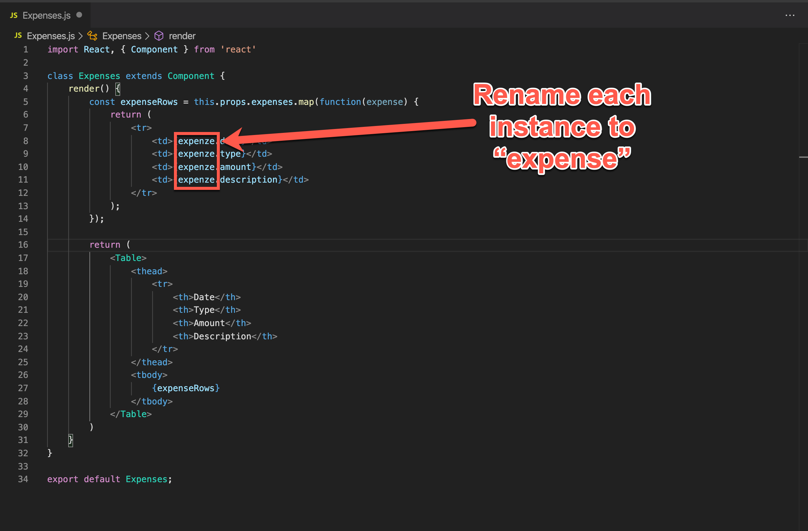
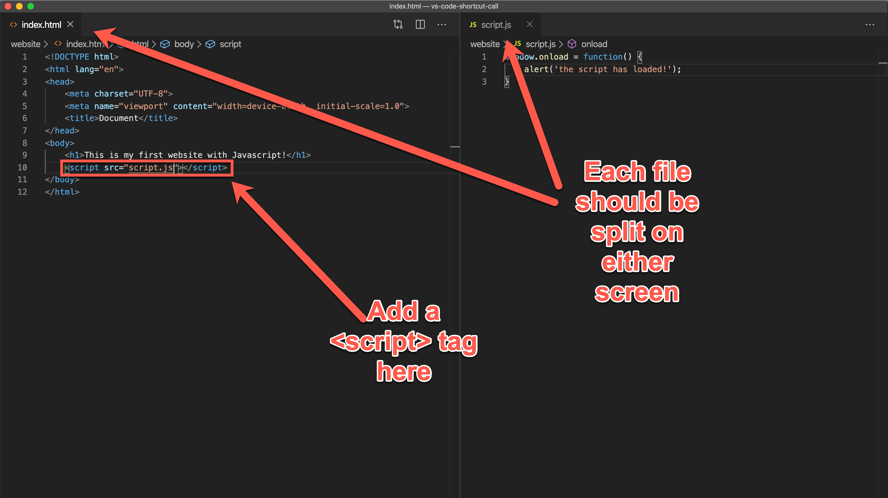

# Challenges

# NOTE: For all these challenges DO NOT USE your mouse

## Challenge #1
Goal: Open up a file called `server.js` and rename `pathz` to `path`

  

## Challenge #2
Goal: Open up a file called `database.py`

  

## Challenge #3
Goal: Open up a file called `Expenses.js` and rename 4 instances of `expenze` to `expense`, then close the tab

  

## Challenge #4
Goal: Open up a file called `index.html`, open up a file called `script.js`, split the `script.js` file to the right side of the screen.
 
Steps:
 1. Open a file called `index.html`
 2. Open a file called `script.js`
 3. Split the `script.js` file to the right side of the screen
 4. Bring the cursor focus to the `index.html` file
 5. Add a `<script>` tag to import `script.js`

Final result:

  

## Challenge #5
Goal: Open up a file called `server.js` and rename `pathz` to `path`

  

## Challenge #6 
Goal: Open up a file called `database.py`

  

## Challenge #7
Goal: Open up a file called `server.js` and rename `pathz` to `path`

  

## Challenge #8
Goal: Open up a file called `database.py`

  

## Challenge #9
Goal: Open up a file called `server.js` and rename `pathz` to `path`

  

## Challenge #10
Goal: Open up a file called `database.py`

  

