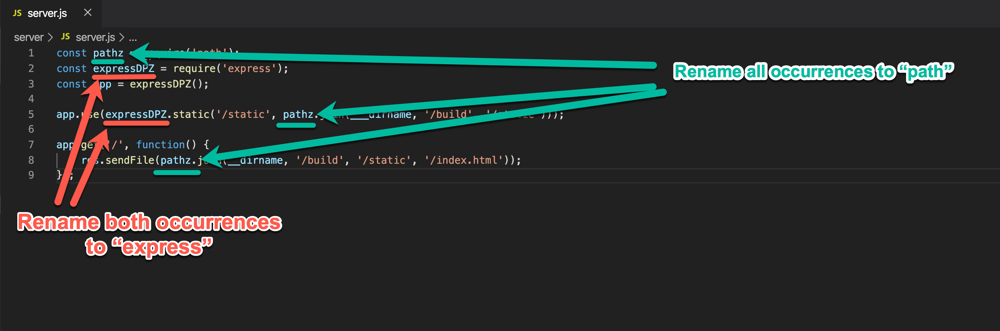
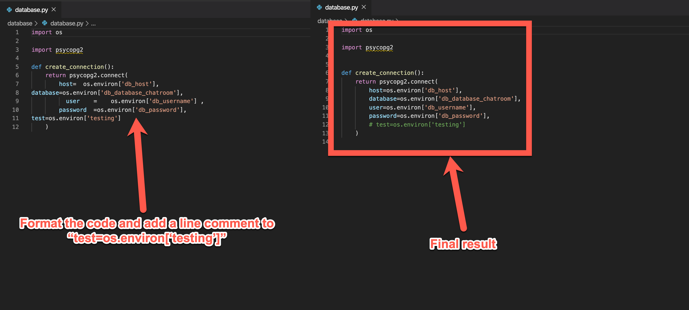
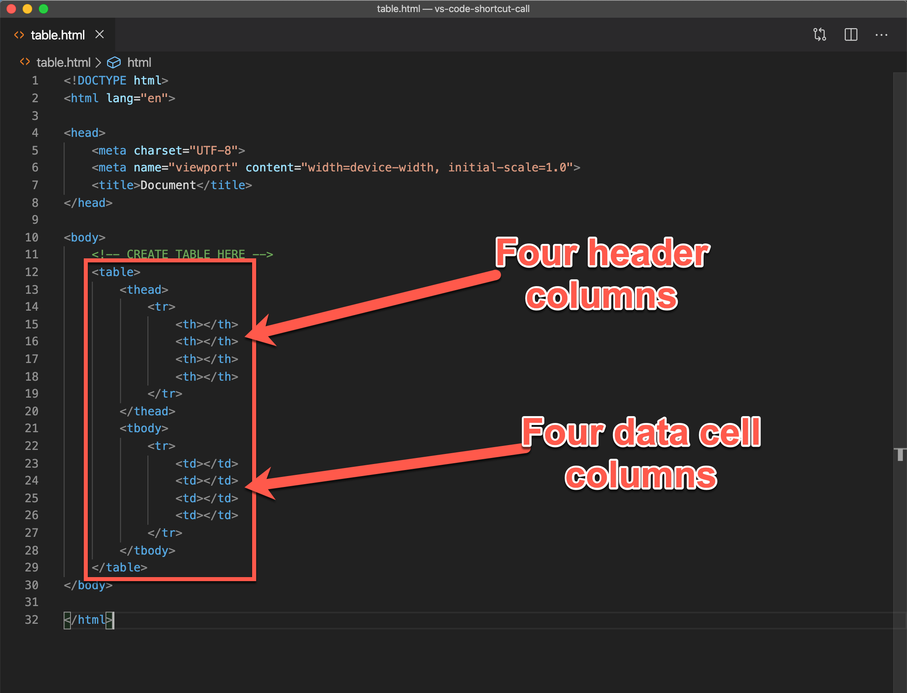
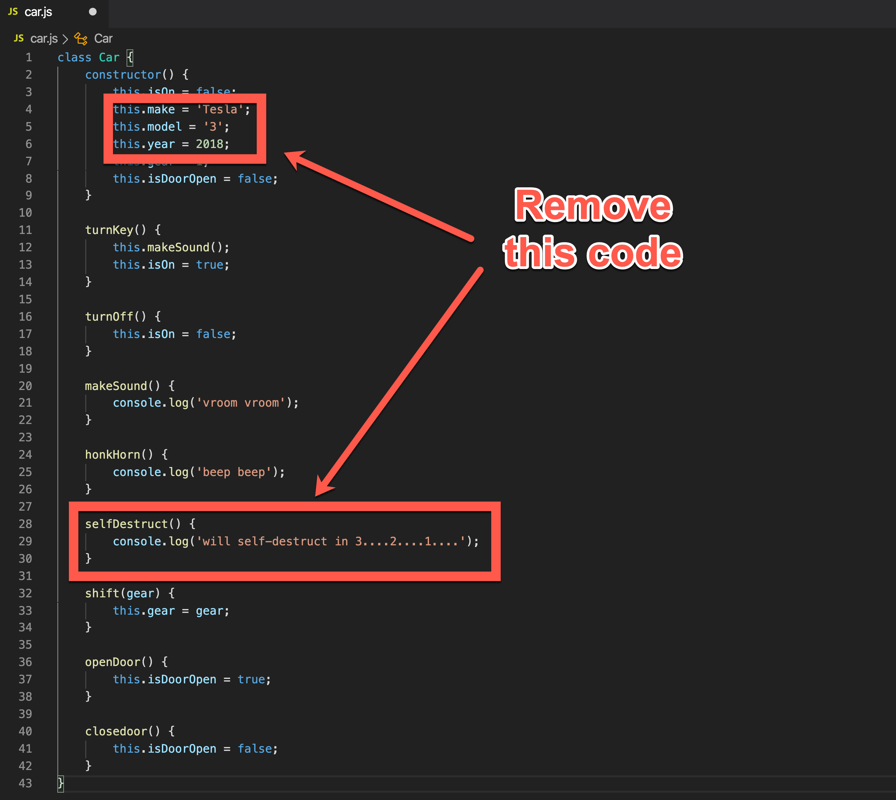
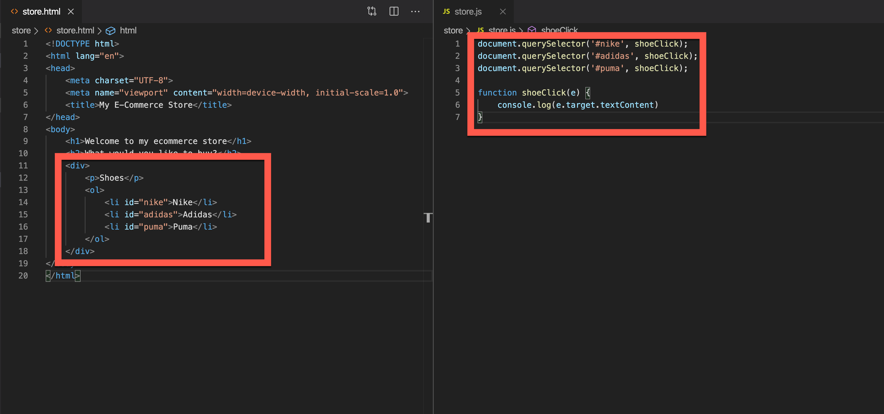
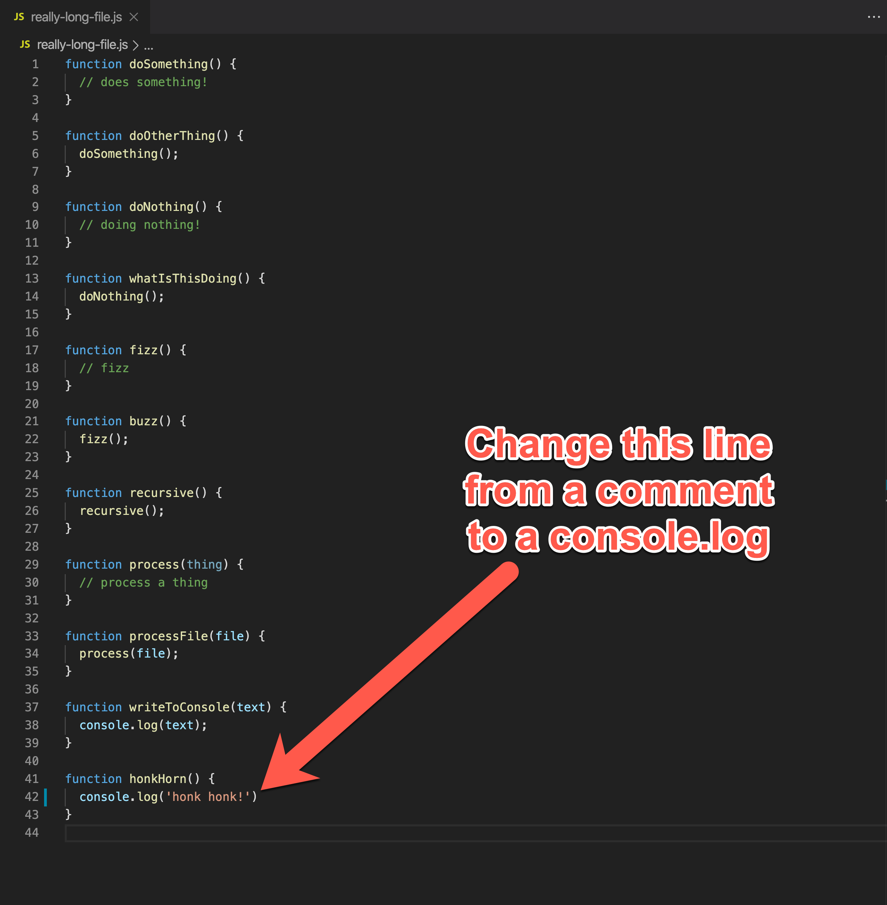
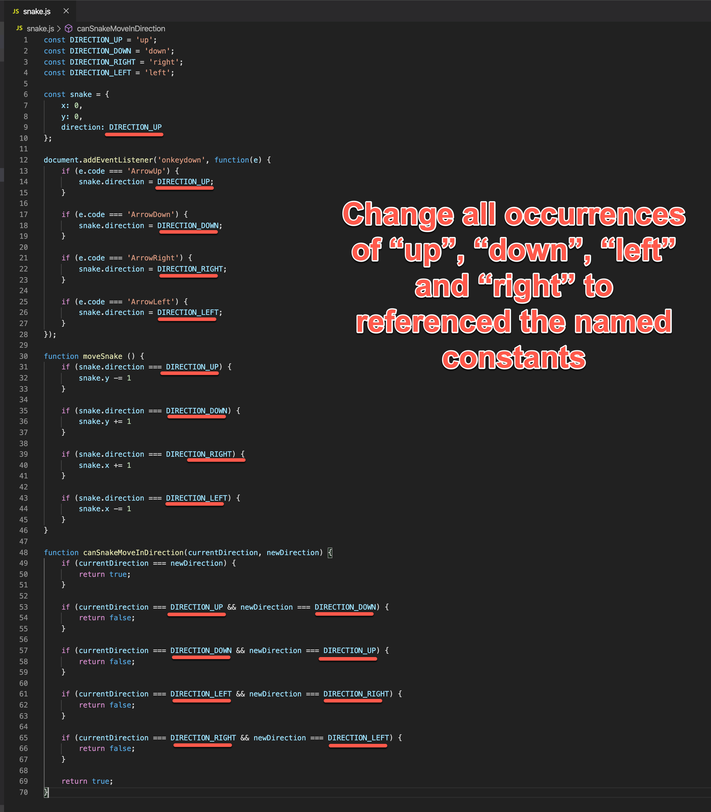

# Challenges

# NOTE: For all these challenges DO NOT USE your mouse

## Challenge #1
_Goal: Open up a file called `server.js` and rename `pathz` to `path`_

Steps:
 1. Close all existing files on in Visual Studio Code
 2. Open a file called `server.js`
 3. Rename all occurences of `pathz` to `path`
 4. Rename all occurences of `expressDPZ` to `express`

  

 

## Challenge #2
Goal: Open a file, format it properly and comment out a line of code

Steps:
 1. Close all existing files on in Visual Studio Code
 2. Open a file called `database.py`
 3. Format the code in the `create_connection` function so the lines are properly indented
 4. Comment out this single line of code: `test=os.environ['testing']`

  

 

## Challenge #3
_Goal: Open up a file called `Expenses.js` and rename 4 instances of `expenze` to `expense`, then close the tab_

  

 

## Challenge #4
_Goal: View an HTML and Javascript file side-by-side. Add a script tag to the HTML file._
 
Steps:
 1. Close all existing files on in Visual Studio Code 
 1. Open a file called `index.html`
 2. Open a file called `script.js`
 3. Split the `script.js` file to the right side of the screen
 4. Bring the cursor focus to the `index.html` file
 5. Add a `<script>` tag to import `script.js`

Final result:

  

 

## Challenge #5
_Goal: Create an HTML table_

Steps:
 1. Close all existing files on in Visual Studio Code 
 1. Open a file called `table.html`
 2. Create a blank line at line 12
 3. Create a `<table>` element
 4. Inside of the `<table>` element, create a `<thead>` element
 5. Inside of the `<thead>` element, create a single `<tr>` element
 6. Inside of the `<tr>` element, create four `<th>` elements
 7. After the `<thead>` element, create a `<tbody>` element
 8. Inside of the `<tbody>` element, create a single `<tr>` element
 5. Inside of the `<tr>` element, create four `<td>` elements

Final result:

  

 

## Challenge #6 

_Goal: Change certain strings to named constants_

Steps:
 1. Close all existing files on in Visual Studio Code 
 2. 
 3. 
 4. 
 5. 

  

 

## Challenge #7
_Goal: Navigate File, Comment out stuff_

Steps:
 1. Close all existing files on in Visual Studio Code 
 2. 
 3. 
 4.  
 5. 

  

 

## Challenge #8
_Goal: Find symbol in a long file and modify_

Steps:
 1. Close all existing files on in Visual Studio Code 
 2. 
 3. 
 4. Create a new commit by running `git add --all` by `git commit -m "new commit"`
 5. Close terminal window

  

 

## Challenge #9
_Goal: Open up a file called `server.js` and rename `pathz` to `path`_

Steps:
 1. Close all existing files on in Visual Studio Code 
 2.   
 3. 
 4. 
 5. 

  

 

## Challenge #10
_Goal: Change certain strings to named constants_

Steps:
 1. Close all existing files on in Visual Studio Code 
 1. Open a file called 'snake.js'
 2. Change all instances of the stirng `'up'` to `DIRECTION_UP`
 3. Change all instances of the stirng `'down'` to `DIRECTION_DOWN`
 4. Change all instances of the stirng `'left'` to `DIRECTION_LEFT`
 5. Change all instances of the stirng `'right'` to `DIRECTION_RIGHT`

  

